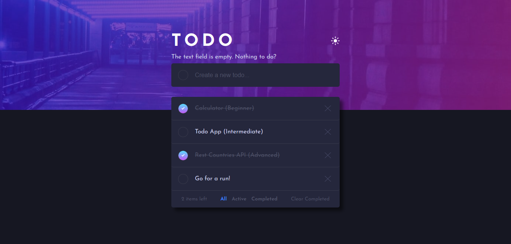
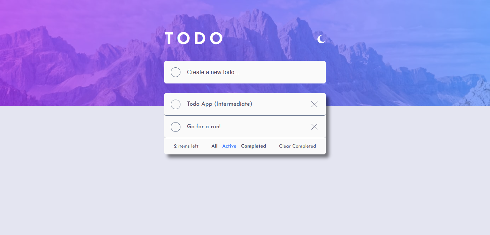
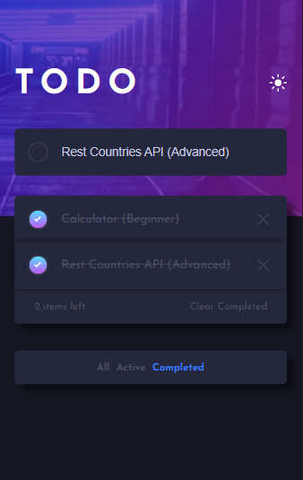
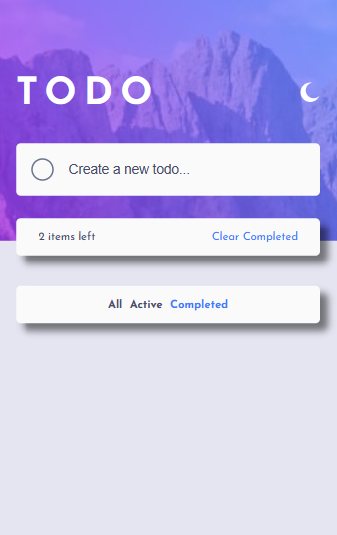

# Todo App with local storage (Intermediate)

This is a solution to the [Todo app challenge on Frontend Mentor](https://www.frontendmentor.io/challenges/todo-app-Su1_KokOW). 

## Table of contents
- [The challenge](#the-challenge)
- [Built with](#built-with)
- [Continued development](#continued-development)
- [Screenshots](#screenshots)

### The challenge

Users should be able to:

- View the optimal layout for the app depending on their device's screen size
- See hover states for all interactive elements on the page
- Add new todos to the list
- Mark todos as complete
- Delete todos from the list
- Filter by all/active/complete todos
- Clear all completed todos
- Toggle light and dark mode

### Built with

- Semantic HTML5 markup
- CSS custom properties
- Flexbox
- Media Queries
- Vanilla JavaScript ES6+
- Desktop-first workflow

### Continued development

- Drag and drop to reorder items on the list
- Rebuilt the app with a real time database (instead of local storage)

### Screenshots

